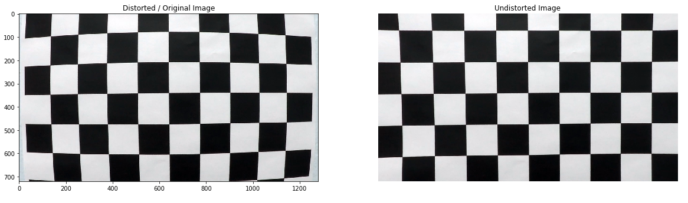

### Project 4 - Advanced Lane Finding

The goals / steps of this project are the following:

* Compute the camera calibration matrix and distortion coefficients given a set of chessboard images.
* Apply a distortion correction to raw images.
* Use color transforms, gradients, etc., to create a thresholded binary image.
* Apply a perspective transform to rectify binary image ("birds-eye view").
* Detect lane pixels and fit to find the lane boundary.
* Determine the curvature of the lane and vehicle position with respect to center.
* Warp the detected lane boundaries back onto the original image.
* Output visual display of the lane boundaries and numerical estimation of lane curvature and vehicle position.

In project 1, a simple pipeline with multiple limitations has been applied. In this project, the goal is to provide a more robust lane detection using more advanced techniques such as color and gradient thresholding, polynomial fitting of 2nd degree to capture curvature in lanes, and apply camera calibration, perspective transform and image distortion/undistortion techniques.

The next sections will cover the steps above one by one: How the camera matrix - needed for calibration - has been obtained, and how it was used in the overall pipeline to find lanes. We will show the result of applying each step on test images, and finally, on a stream of frames from the project video.

#### Camera Calibration and Distortion Correction

We will use a set of test images of a chess board, to find the camera matix and distortion coeffs. The function `findChessboardCorners()` is used and it needs the number of horizontal and vertical corners in the chess board. For this section, I ran this method on the set of 20 chess board images with different value of nx and ny in the code below.

```python
# Number of inside corners along the x and y axis
nx = 9
ny = 6 

# Arrays to store object points and image points from all images
objpoints = []
imgpoints = []

# Prepare object points in this format (0,0,0), (1,0,0), ..., (7,5,0)
objp = np.zeros((ny*nx, 3), np.float32)
objp[:,:2] = np.mgrid[0:nx, 0:ny].T.reshape(-1,2)

# Step through the list and search for chessboard corners
for index, fname in enumerate(images):
    img = cv2.imread(fname)
    gray = cv2.cvtColor(img,cv2.COLOR_BGR2GRAY)

    # Find the chessboard corners
    ret, corners = cv2.findChessboardCorners(gray, (9,6),None)
    # If found, add object points, image points
    if ret == True:
        objpoints.append(objp)
        imgpoints.append(corners)

        # Draw and display the corners
        img = cv2.drawChessboardCorners(img, (9,6), corners, ret)
        imgs_.append(img)
```

For these values (nx = 9 and ny = 6) the `findChessboardCorners()` method returned 17 sets of corners. This is the maximum number of returned set of corners. The figure below shows the detected corners on one of the chessboard images.


Now the detected corners will be used to get the camera matrix. We use the `CalibrateCamera()` method, which takes a set of points in the original, distorted image and their equivalents in the undistorted images, and applied the pin-hole camera model and projects the points using perspective transformation on an image plane. [More details here](http://docs.opencv.org/2.4/modules/calib3d/doc/camera_calibration_and_3d_reconstruction.html).

After getting the calibration parameters, they are used to undistort images as follows:

```python
# Read image and retrieve the size
img = cv2.imread('../camera_cal/calibration1.jpg')
gray = cv2.cvtColor(img,cv2.COLOR_BGR2GRAY)
size = (gray.shape[1], gray.shape[0])
# Calibrate the camera using the derived object points
ret, mtx, dist, rvecs, tvecs = cv2.calibrateCamera(objpoints, 
                                                   imgpoints, 
                                                   size, 
                                                   None, 
                                                   None)
# undistort the image using the derived calibration parameters
img_undist = cv2.undistort(img, mtx, dist, None, mtx)
```

The following two figures show how the calibration parameters are applied on two images: A chess board and a traffic image.




#### Color Transforms and Gradients

Next, we use color transfomration and gradients (Sobel fitler) to create a binary, thresholded image where the resulting image emphasises the lane lines.

* Color Transforms

We convert the image from RGB to HLS to separate brightness data in the image from other color components, then we apply thesholding on the Saturation channel to capture, as well as possible, the lane lines.


```python
def color_thresh(img, plot=False):
    '''
    Apply thresholding on the Saturation channel in HLS space
    
    Input:
        img: Image in RGB
        
    '''
    # Convert color space to HLS
    hls_img = cv2.cvtColor(img, cv2.COLOR_RGB2HLS).astype(np.float)
    # Get the L Channel
    s_ch = hls_img[:,:,2]
    
    s_thresh_min = 140
    s_thresh_max = 255
    
    s_binary = np.zeros_like(s_ch)
    s_binary[(s_ch >= s_thresh_min) & (s_ch <= s_thresh_max)] = 1
    
    if plot:
        plt.imshow(s_binary, cmap='gray')
    
    return s_binary
 ```

* Sobel Filter

We apply the sobel filter in the x-direction, to detecte sudden intensity changes that are vertical in the image planes. These intensity changes represent the bright lane lines. We also apply thresholds on the gradient strength to reject noise - small edges that could be attributed to tree leafs etc. The following method gets the horizontal gradient and applies thresholds limited to strength between 40 and 100 on the binary gradient image. The sobel filter is applied only on the L channel in the HLS color space, as it encodes the brightness in the iamge.


```python
def gradient_thresh(img, plot=False):
    '''
    Apply sobel filter in the horizontal direction to get vertical lines
    that represent the lanes.
    
    The sobel filter is applied in the HLS domain on the L channel, since 
    it is mainly dependent on intensity values
    
    Input:
        img: Image in RGB
    '''
    # Convert color space to HLS
    hls_img = cv2.cvtColor(img, cv2.COLOR_RGB2HLS).astype(np.float)
    # Get the L Channel
    l_ch = hls_img[:,:,1]
    # Apply Sobel filter in horizontal direction
    sobelx = cv2.Sobel(l_ch, cv2.CV_64F, 1, 0)
    # Take absolute value of the sobel_x filter
    abs_sobelx = np.absolute(sobelx)
    # Scale the sobel 
    scaled_sobelx = np.uint8(255*abs_sobelx/np.max(abs_sobelx))
    
    # Apply upper and lower thresholds on the x-direvatives (gradient strength)
    thresh_min = 40
    thresh_max = 100
    # Select pixels based on gradient strength
    sxbinary = np.zeros_like(scaled_sobelx)
    sxbinary[(scaled_sobelx >= thresh_min) & (scaled_sobelx <= thresh_max)] = 1
    
    if plot:
        plt.imshow(sxbinary, cmap='gray')
        
    return sxbinary
  ```

After obtaining the threshoded images from both of the previous functions, both on gradient and on the saturation color channel, we combine these two binary sources together. The figure below demonstrates the results.

```python
def combine_thresholds(grad, color):
    '''
    Combine color thresholding and gradient thresholding
    '''
    
    combined_binary = np.zeros_like(grad)
    combined_binary[(color == 1) | (grad == 1)] = 1
    
    return combined_binary
```


#### Perspective Transformation


Now with the camera matrix and distortion parameters, we can apply perspective transform on an image of the street. Using `cv2.getPerspectiveTransform()`, with a set of 4 points in the source, distorted image and 4 points in the destination image, we can get the transformation matrix. This matrix can then be applies on other images taken by a camera with the same intrinsic and extrensic parameteres. `cv2.warpPerspective()` will use the transformation matrix to apply the perspective transform on that image. The following `warp()` method contains the pipeline for warping the image. We also provide another helper method `draw_straight_lines()` to draw lines between points on the warped and original image.

```
def warp(img, src, dst):
    img_size = (img.shape[1], img.shape[0])
    M = cv2.getPerspectiveTransform(src, dst)
    Minv = cv2.getPerspectiveTransform(dst, src)
    warped = cv2.warpPerspective(img, M, img_size, flags=cv2.INTER_LINEAR)
    return Minv, warped
```

The following image shows the warp process using a set of points chosen from the source and destination image. Those points were selected manually in such a way the transformation would provide parallel lines in the transform image. This is done only once, and after that, the transformation applies to other images taken by the same camera.


Here are the points in the source and destination:

```python

src = [[  590. , 460.]
 [  203. , 720.]
 [ 1116. , 720.]
 [  690., 460.]]


dst = [[ 320.    0.]
 [ 320.  720.]
 [ 960.  720.]
 [ 960.    0.]]

```


#### Finding Lanes

In this section we discuss how the last four goals were achieved, we start with how the lane pixels are detected and how we decide the boundary of the lane. In the produced binary image, the lane lines stand clearly. In the histogram for this image (binary, warped image), the peaks on the left and right of the center would most likely represent these lane lines. In the figure below, the spikes in the histogram align with the lane lines. 


* Sliding Window and Line Fitting1


The ROI to search for lane lines is the bottom half of the image. We start with a sliding window along the botton of the image, with a specific height, depending on the number of the windows. Here, we use 15 images. The window slides along the bottom and the two spikes are marked either left or right depending on their location w.r.t. the mid-point.

After that, for each spike, the sliding window goes one level above to locate the continuation of the lane line. This process is repeated in a for-loop for a `window_number` times.

For each window, along each line, where a lane line is detected, the centroid is found and a collection of points associated with each lane line is created. We can then use these points to fit a second degree polynomial that captures the curvature of a road.

All the logic for the is in the `find_lanes()` method. The figure below shows the visualization of the fitted line, and the sliding windows along each one. After detecting the lane lines, we can apply inverse perspective transform to warp the detected lane boundaries back onto the original image.


* Curvature

To meature the curvature radius, the curvature equations are computed using the equations in [following tutorial](http://www.intmath.com/applications-differentiation/8-radius-curvature.php), as well as the length and width of the section of the road being projected on the warped image. According to the section's instructions: 

"We could do this in detail by measuring out the physical lane in the field of view of the camera, but for this project, you can assume that if you're projecting a section of lane similar to the images above, the lane is about 30 meters long and 3.7 meters wide. Or, if you prefer to derive a conversion from pixel space to world space in your own images, compare your images with U.S. regulations that require a minimum lane width of 12 feet or 3.7 meters, and the dashed lane lines are 10 feet or 3 meters long each."

This is implemented in the `curvature()` method.

* Apply the pipeline on a set of test images and a video stream

The following method applies the pipeline on a set of test images. The results are show afterwards. First, the image is undistorted using the calibration parameters. We then warp the image using src and dist points to a bird-view, using perspective transform. Then we get the binary thresholded, warped image and apply the `find_lanes()` method on it: Sliding window technique with histogram peaks, and polynomial fitting. We then get the curvature and visualize the original image with the detected lane and curvature projected on top of it.


```python
def detect_lanes(img, mtx, dist):
    undist = cv2.undistort(img, mtx, dist, None, mtx)
    Minv, warped = warp(undist, src, dst)
    img_color_thresh = color_thresh(warped)
    img_grad_thresh = gradient_thresh(warped)    
    binary_warped = combine_thresholds(color=img_color_thresh, grad=img_grad_thresh)    
    leftx, lefty, rightx, righty = find_lanes(binary_warped)
    ploty, left_fitx, right_fiqtx = polyfit(binary_warped, leftx, lefty, rightx, righty)
    left_curverad, right_curverad = curvature(ploty, leftx, lefty, rightx, righty)
    return visualization(binary_warped, ploty, left_fitx, right_fitx, Minv, undist, left_curverad, right_curverad)
```


Here are the results:


The pipeline is also applied on a video stream frame by frame the same way. The results are in this [Youtube video](https://www.youtube.com/watch?v=SuaKHg4joFw&feature=youtu.be).


#### Discussion


In this project, a more robust lane detection method has been implemented, compared to the first project in the term. Some of the limitations, though, are the need for manual tuning at the beginning and the need for a continuous lane line. For example, if the gap between lane lines is large, the car might go out of lane, since the histogram peak might not exist on the lane line. This could happen due to reasons such as faded color of lane lines and other reasons.

Some ways to improve the pipeline:

* Enhance the contrast in each frame: This helps in shadow areas. I had problems with a section of the street where there was a tree shoado, this led the peaks of the histogram to be offset from the lane lines. By enhancing contrast, we make sure thresholding captures the lane lines more clearly.

* Apply Kalman Filters on each lane line: This should produce a smooth frame-to-frame visualizations of the lane. This is a term 2 topic and would like to apply it later.

For the first problem, where I had some lane-lines off due to shadowy areas, I tried to minimize it by tracking the MSE of the current lane line with the previous one, and if the MSE is above 500 (I chose this value based on trial and error) then I use the previous lane line. If it's less than 500 then I use the current lane line.

Here is the code:

```python
from sklearn.metrics import mean_squared_error

def detect_lanes(img, mtx, dist, overlay=None):
    undist = cv2.undistort(img, mtx, dist, None, mtx)
    Minv, warped = warp(undist, src, dst)
    img_color_thresh = color_thresh(warped)
    img_grad_thresh = gradient_thresh(warped)    
    binary_warped = combine_thresholds(color=img_color_thresh, grad=img_grad_thresh)    
    leftx, lefty, rightx, righty, out_img = find_lanes(binary_warped)
    ploty, left_fitx, right_fitx = polyfit(binary_warped, leftx, lefty, rightx, righty)
    aaa.append(right_fitx)
    
    if overlay is not None:
        if len(overlay.right_lane) <= 10:
            overlay.right_lane.append(right_fitx)
            overlay.left_lane.append(left_fitx)
        if len(overlay.right_lane) > 10:

            mse_right = mean_squared_error(right_fitx, overlay.right_lane[-2])
            mse_left = mean_squared_error(left_fitx, overlay.left_lane[-2])

            if mse_right <= 400:
                overlay.right_lane.append(right_fitx)
            if mse_right > 400:
                right_fitx = overlay.right_lane[-2]
                overlay.right_lane.append(right_fitx)
                
            if mse_left <= 400:
                overlay.left_lane.append(left_fitx)
            if mse_left > 400:
                left_fitx = overlay.left_lane[-2]
                overlay.left_lane.append(left_fitx)

    left_curverad, right_curverad = curvature(ploty, leftx, lefty, rightx, righty)

    viz = visualization(binary_warped, ploty, left_fitx, right_fitx, Minv, undist, left_curverad, right_curverad)
    return viz


class Overlay:
    def __init__(self):
        self.right_lane = []
        self.left_lane = []

overlay_obj = Overlay()

def process_image(img, overlay=None):
    return detect_lanes(img, mtx, dist, overlay=overlay_obj)
```